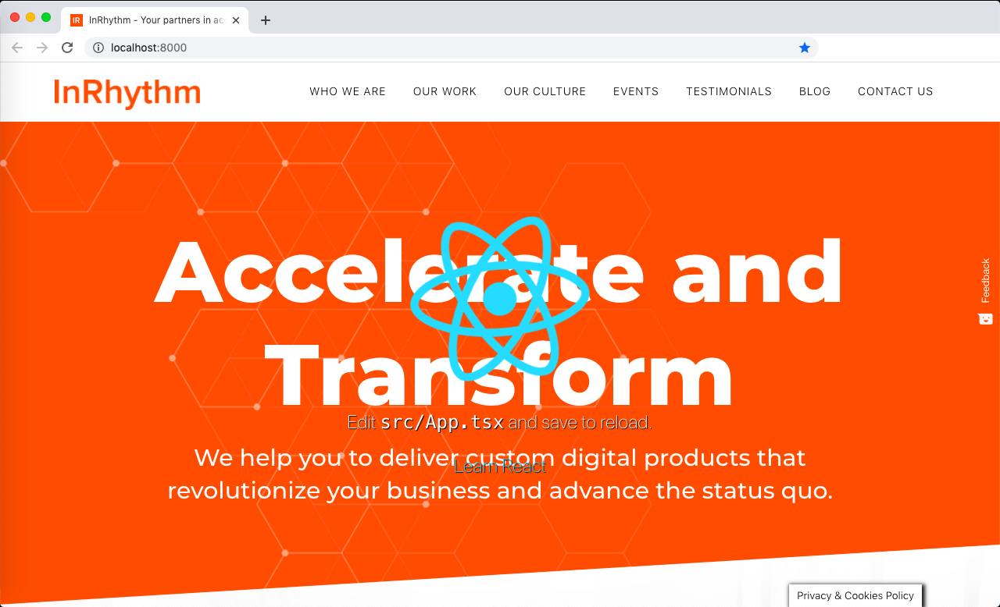

# Code Collider v2

This project can inject one website/app into another. This is useful when you are asked to collaborate with another team and provide them with code but aren't able/allowed to run their dev environment.

Also a chance to practice Express, proxies, network requests, etc

## Set up

- Prerequisites: Node
- Run the following in one terminal
  ```
  cd node-express-proxy
  npm install
  ```
- Run the following in another terminal
  ```
  cd create-react-app
  npm install
  ```

## To Run
- Open /node-express-proxy/config.js and pick 2 sites to combine. Make sure they are both running.
- Run the following (or use the corresponding VSCode debug script)
  ```
  cd node-express-proxy
  npm start
  ```
- If you wish to try injecting create-react-app into another site, you can run the following
  ```
  cd create-react-app
  npm start
  ```
- Open the following in your browser  
  http://localhost:8000
  http://localhost:8000/code-collider
- Optionally: open config.js and change the 2 websites/apps to combine

## Notable Files

These are most interesting files to look at and learn from:

- /node-express-proxy/config.js
- /node-express-proxy/routes/proxy.route1.js - original solution with "creative" use of HTML's base tag
- /node-express-proxy/routes/proxy.route2.js - better solution that first asks WEBSITE1 for every resourse and then if 404, asks WEBSITE2

## Resources

The following resources were important in creating this project

- Proxies and piping responses  
  https://github.com/request/request  
  https://stackoverflow.com/questions/49588323/pipe-response-on-callback/49672218#49672218  
  https://stackoverflow.com/questions/18141499/mikeals-nodejs-request-modify-body-before-piping/19822124#19822124
- HTML base tag
  https://www.w3schools.com/tags/tag_base.asp  
  https://stackoverflow.com/questions/807878/how-to-make-javascript-execute-after-page-load/36096571#36096571

## Screenshot
Create React App combined with InRhythm.com

